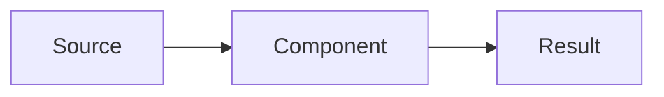

# <Title Case Name>

## Summary

Two or three sentences: what is being built and why it matters. Readable on its own.

## Problem

What is wrong or missing today, stated against the current state of the repository. Include the concrete trigger — the bug, the manual step, the limit that was hit.

## Goals

- What this design must achieve.

### Non-goals

- What this design deliberately leaves out, so scope creep is visible later.

## Design

The proposed shape: components, data flow, interfaces, storage, failure behaviour. Name real files and functions where they exist.

## Alternatives considered

| Option | Why not |
| --- | --- |
| <Alternative> | <Reason rejected> |

## Impact

What changes for existing code, data, and workflows. Migration or backfill needed, if any.

## Open questions

- <Unknown, and what would resolve it.>

## Assumptions

- <Anything taken as given while drafting, so a wrong assumption is easy to spot.>

## Related

- [[Other Design Doc]]
- [Reference](https://example.com)
